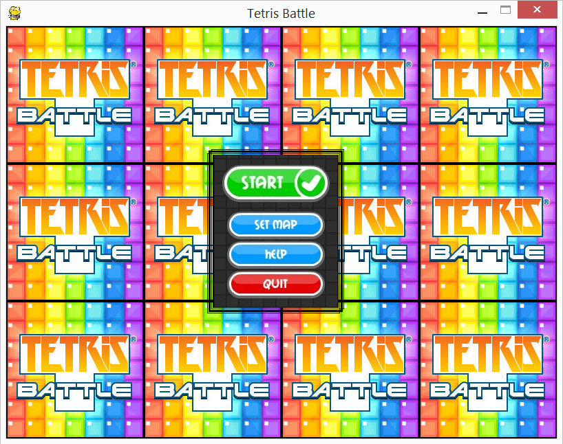
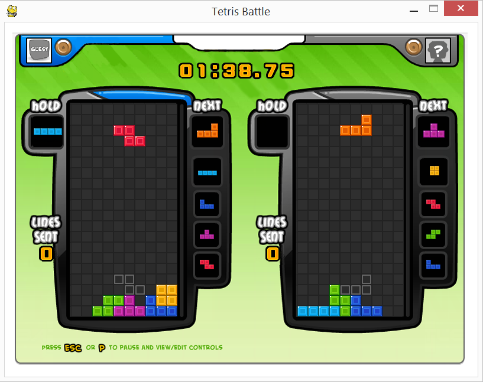

Tetris-Battle
=============

Tetris Battle is a Python/Pygame replica of the popular Facebook [Game](https://apps.facebook.com/tetris_battle/).

This version of Tetris Battle is made so that two players play on the same keyboard. 

In order to run this application, Python 2.7 IDE and Pygame for Python 2.7 must be installed. 

Install Python 2.7:
https://www.python.org/download/releases/2.7/

Install Pygame:
http://www.pygame.org/download.shtml

To run the game, run MAIN.py
